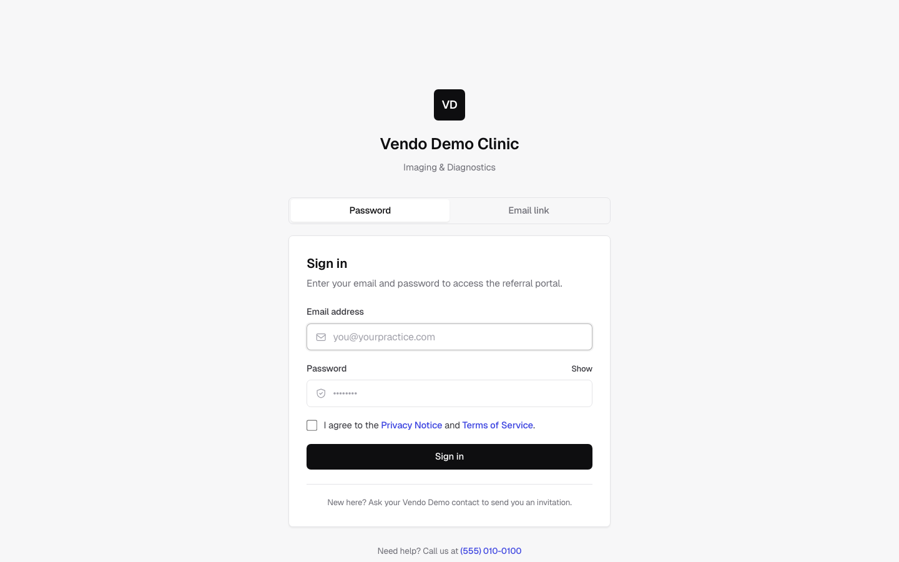
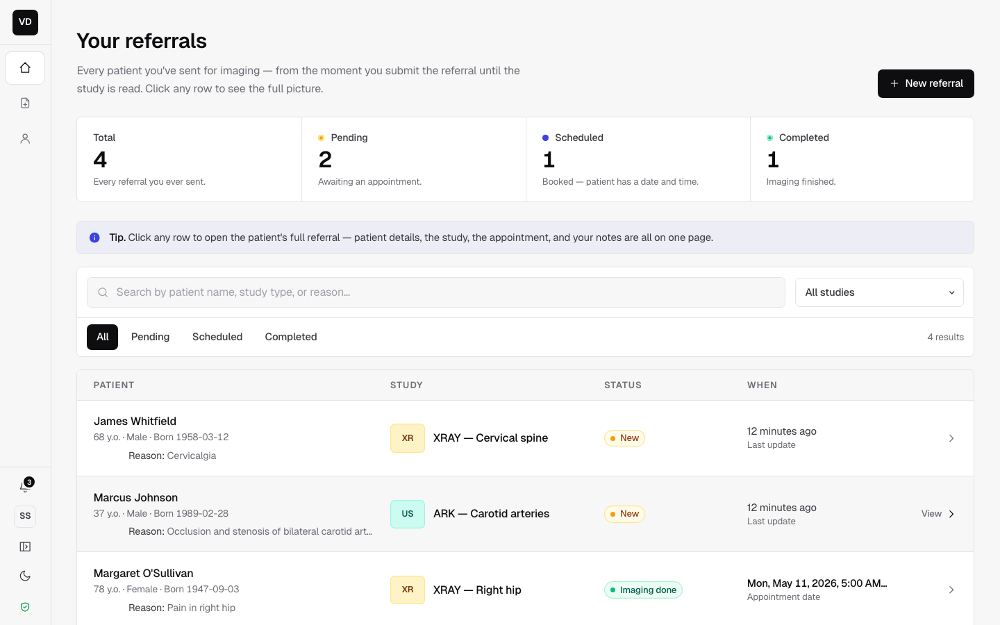
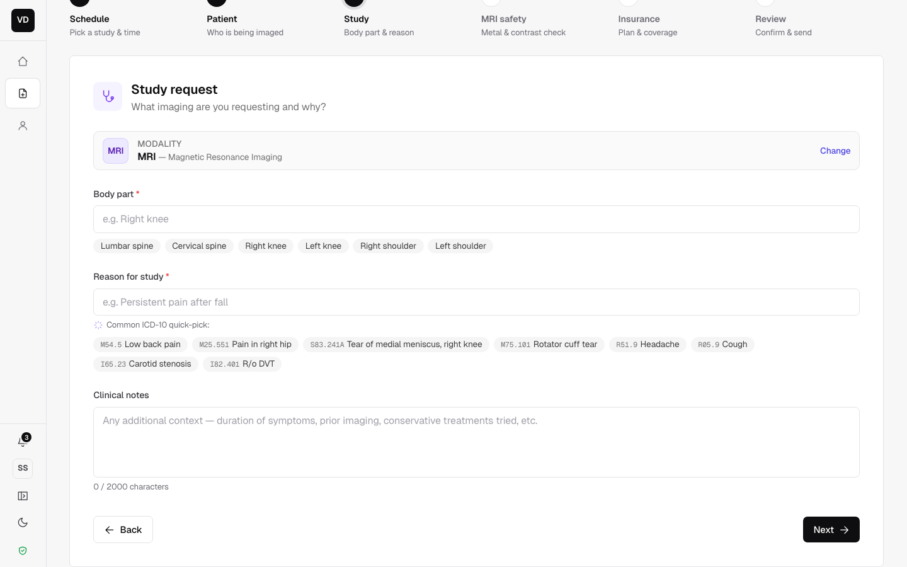
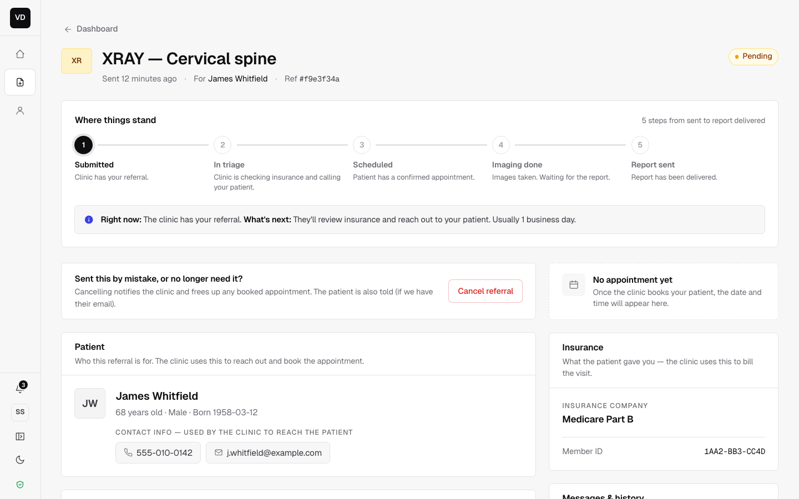
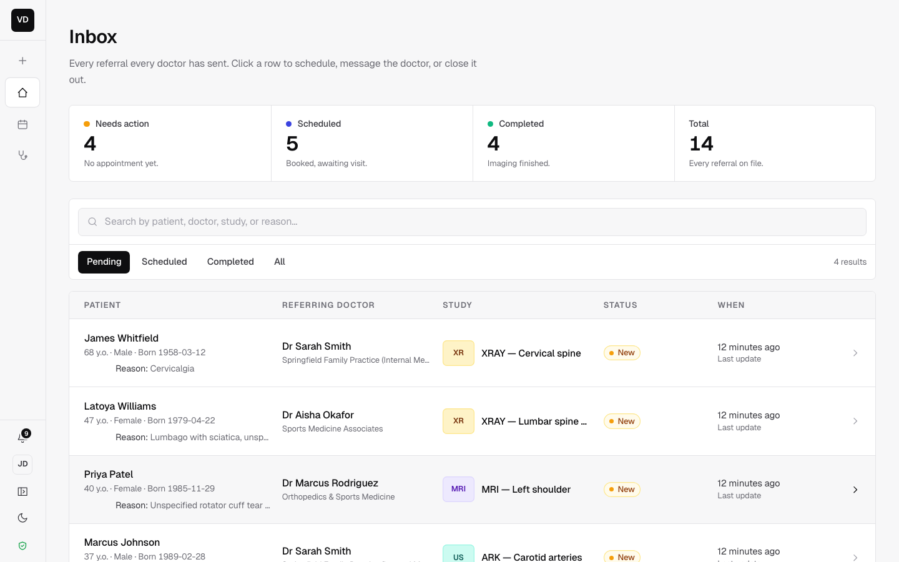
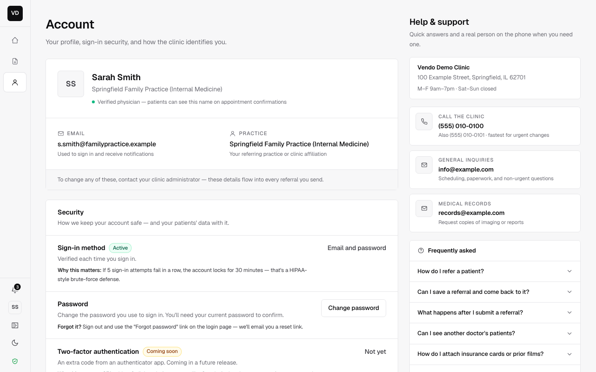

# Vendo — HIPAA-aware imaging-referral portal

Self-hosted referral portal for an outpatient imaging clinic. Referring
physicians submit patients for **MRI / X-ray / ultrasound** studies, pick a
slot, and track each referral through scheduling, imaging, and final report.
Front-desk staff run the inbox side: accept, reschedule, cancel, complete.

Built on **Medplum** (FHIR backend + auth) with a **Next.js 15** App Router
front-end. Originally deployed for a single clinic in production; this repo
is the same code, with branding pulled behind env vars so it can run for any
tenant.

> **Status.** Production-deployed v1.0. Everything tagged `[v1.1]` in the
> planning docs is deferred — see [`TODO.md`](TODO.md) for what's intentionally
> not done.

## Screenshots

| | |
|---|---|
|  |  |
|  |  |
|  |  |

> All patient names, DOBs, phone numbers, member IDs, and clinical notes
> shown above are LLM-generated synthetic demo data — no real PHI. The
> seed fixture lives at `infra/compose/seed/src/realistic-seed.ts`.

## What's interesting in here

If you're scanning the repo for ideas worth stealing:

- **AccessPolicy via FHIRPath `%profile`.** A single `Referrer` AccessPolicy
  gives every referrer access only to resources where `requester` resolves to
  their own Practitioner. No per-user policies, no app-layer filters — the
  isolation is enforced inside Medplum's query rewriter. Integration test in
  [`infra/compose/seed/src/isolation.integration.test.ts`](infra/compose/seed/src/isolation.integration.test.ts)
  hits a real Medplum and asserts that referrer A literally cannot see
  referrer B's referrals over FHIR REST.

- **Magic-link auth that doesn't fight Medplum.** Medplum has no first-class
  passwordless flow, so the portal mints its own HMAC-signed token, then
  exchanges it for a Medplum session via a service-account login. The token
  carries `{ sub, em, jti, exp }` and is replay-proof through a JTI table.
  See [`apps/portal/src/lib/auth/magic-link.ts`](apps/portal/src/lib/auth/magic-link.ts)
  and [`apps/portal/src/lib/auth/medplum-login.ts`](apps/portal/src/lib/auth/medplum-login.ts).

- **Self-healing watchdog.** A 60-second systemd timer probes Docker health
  + an end-to-end `/api/health` request. Three consecutive failures →
  `docker compose up -d` the affected service, with a 10-minute cooldown so
  a permanent failure doesn't thrash. Catches the "container alive, app
  hung" failure that Docker's own restart policy misses. Code in
  [`infra/compose/scripts/watchdog.sh`](infra/compose/scripts/watchdog.sh).

- **Brand-aligned transactional email.** Every notification (welcome, magic
  link, scheduled, rescheduled, cancelled, completed, no-show, password
  reset) renders as inline-styled HTML + plaintext, in one envelope, with
  tokens that match the portal's CSS. Outlook-Word-renderer-safe (no flex,
  no grid). [`apps/portal/src/lib/email/templates.ts`](apps/portal/src/lib/email/templates.ts).

- **Wizard with two callers.** The same multi-step referral wizard backs
  both `/refer/new` (referrer-initiated) and `/clinic/book` (front-desk
  walk-in). Variant strings live in one config block; the rest is shared.
  [`apps/portal/src/components/wizard/WizardShell.tsx`](apps/portal/src/components/wizard/WizardShell.tsx).

- **Decision-log driven dev.** Every non-trivial architectural choice is
  written down in [`docs/adrs/`](docs/adrs) before being implemented —
  Medplum-as-backend, isolation via `%profile` AccessPolicy criteria,
  insurance-as-extension vs Coverage resource, iron-session over JWT.
  Useful for picking up where the work left off.

- **Upstream-friendly.** Concrete fix proposals for Medplum live in
  [`docs/upstream/`](docs/upstream). Outstanding right now:
  [PR medplum#9137](https://github.com/medplum/medplum/pull/9137) —
  better `auth/login` error when no `ProjectMembership` exists
  (maintainer ✅ "much more actionable", needs DCO sign-off). The
  magic-link RFC we sent landed on a better, already-in-flight upstream
  design ([discussion #9109](https://github.com/medplum/medplum/discussions/9109)),
  so we added three downstream-use notes there and closed our own RFC.

## Architecture

```
                                 ┌─────────────────────┐
   referring physician           │   Cloudflare Tunnel │   no inbound
   ──────────────────────────────│   (zero-trust edge) │   ports on VPS
                                 └──────────┬──────────┘
                                            │
            ┌───────────────────────────────┴──────────────┐
            │                                              │
   ┌────────▼─────────┐                          ┌────────▼─────────┐
   │  Next.js portal  │ ── server actions ──>    │   Medplum API    │
   │  (App Router 15) │                          │   (FHIR + auth)  │
   └────────┬─────────┘                          └────────┬─────────┘
            │  iron-session cookies                       │
            │  HMAC magic-link JWTs                       │
            ▼                                             ▼
   ┌──────────────────┐                          ┌──────────────────┐
   │  nodemailer SMTP │                          │   PostgreSQL +   │
   │  (Postmark/SES)  │                          │   Redis          │
   └──────────────────┘                          └──────────────────┘
```

The portal is the only thing referrers ever see. Medplum's admin console is
mounted on a separate hostname for clinic-side ops. AccessPolicies + role
identifiers do all the authorization work; the portal trusts what FHIR returns.

## Stack

| Layer | Choice |
|---|---|
| FHIR / auth backend | Medplum (self-hosted) |
| Web framework | Next.js 15 (App Router, Server Actions) |
| UI | React 19, Tailwind, custom design tokens (no component library) |
| Auth | iron-session cookies + HMAC magic-link JWTs |
| Email | nodemailer + inline-styled HTML (StubTransport in dev) |
| DB | Postgres 15 (Medplum's persistence) |
| Cache | Redis (Medplum's session/job store) |
| Edge | Cloudflare Tunnel (no exposed ports) |
| Tests | Vitest unit + Medplum-integration suite |
| Build | pnpm workspaces, Turborepo |
| Runtime | Node 22, Docker Compose, systemd watchdog |

## Repo layout

```
apps/
  portal/              Next.js 15 referrer + clinic-staff portal
  bots/                Medplum Bot bundles (notifications)
infra/
  compose/             Local + production Docker Compose
  compose/seed/        Idempotent seed package (admin, AccessPolicy, schedules, slots)
  compose/scripts/     gen-keys, gen-prod-config, watchdog, postgres backup
docs/
  adrs/                Architectural decisions (4 short notes)
  upstream/            PR-ready fix proposals for Medplum
  screenshots/         UI captures
DEPLOY.md              End-to-end production deploy guide
TODO.md                Known issues + deferred work
```

## Run locally

Prereqs: Docker, Node 22, pnpm 9, `openssl`, `jq`.

```bash
# 1. Bring up the Medplum stack (Postgres + Redis + Medplum + MailHog)
cd infra/compose
cp .env.example .env
./scripts/gen-keys.sh
docker compose up -d --wait

# 2. Seed admin + project + AccessPolicy + Schedules + Slots
cd seed
cp .env.example .env
pnpm install
pnpm seed

# 3. (Optional) Seed realistic demo data — 4 referrers, 12 patients, 14 referrals
pnpm seed:realistic

# 4. Run the portal
cd ../../../apps/portal
cp .env.example .env
pnpm install
pnpm dev
# → http://localhost:3000
```

Demo logins live in `apps/portal/src/app/dev-login/client.tsx` once the
realistic seed has run.

MailHog UI for inspecting rendered emails: <http://localhost:8025>.

## Tests

```bash
pnpm -r typecheck
pnpm -r test
pnpm -C apps/portal build
```

The cross-referrer **isolation gate** runs against a live Medplum:

```bash
cd infra/compose/seed && pnpm test:integration
```

It asserts that even with a hand-crafted FHIR query, referrer A cannot see
referrer B's `ServiceRequest`, `Patient`, or `DocumentReference` resources.

## Production deploy

End-to-end deploy guide (Cloudflare Tunnel + Docker Compose, single VPS,
~30 min): [`DEPLOY.md`](DEPLOY.md).

Watchdog timer install: [`infra/compose/scripts/install-watchdog.sh`](infra/compose/scripts/install-watchdog.sh).

## Configure your own brand

All brand strings (clinic name, phone, address, support email, portal URL)
are read from `NEXT_PUBLIC_BRAND_*` env vars at build time. Defaults live in
[`apps/portal/src/lib/branding.ts`](apps/portal/src/lib/branding.ts) and ship
as `Vendo Demo Clinic` placeholder values. Override for a real tenant via
`apps/portal/.env`:

```
NEXT_PUBLIC_BRAND_NAME=Acme Imaging
NEXT_PUBLIC_BRAND_SHORT_NAME=Acme
NEXT_PUBLIC_BRAND_INITIALS=AI
NEXT_PUBLIC_BRAND_PHONE=(555) 010-0100
# ...etc — see apps/portal/.env.example for the full list
```

## What's intentionally not in here

See [`TODO.md`](TODO.md) for known issues and the v1.1 backlog. Headlines:
no TOTP MFA, no self-service forgot-password, no Sentry, no patient-facing
accounts. Everything is documented.

## Built on Medplum

Big chunk of the heavy lifting (FHIR, AccessPolicies, search index, Bot
runtime, audit log) is Medplum. Their work, their license. See
<https://github.com/medplum/medplum>.

## License

MIT — see [`LICENSE`](LICENSE).
